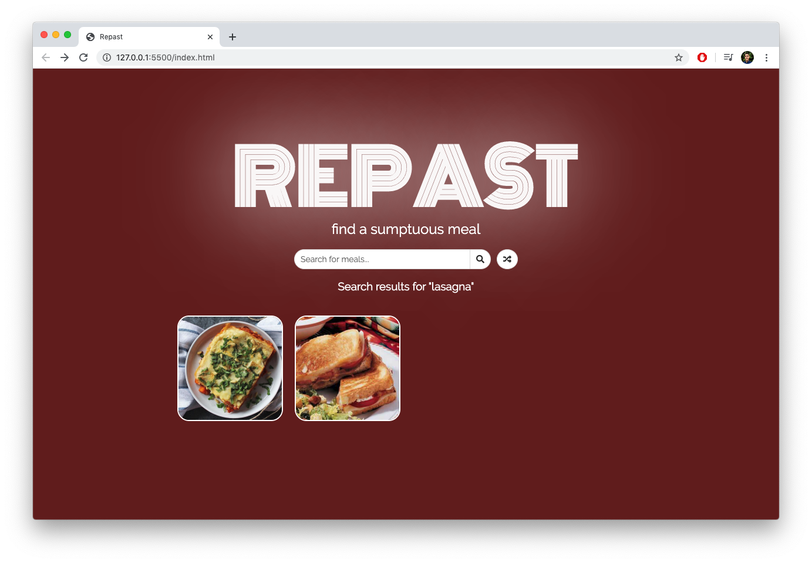
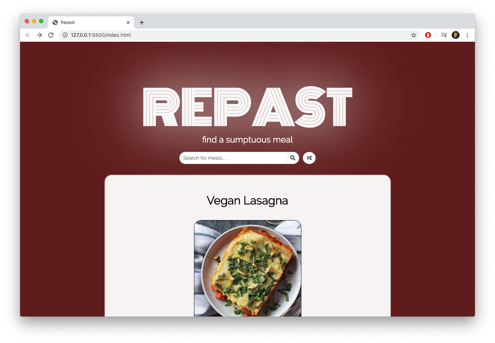
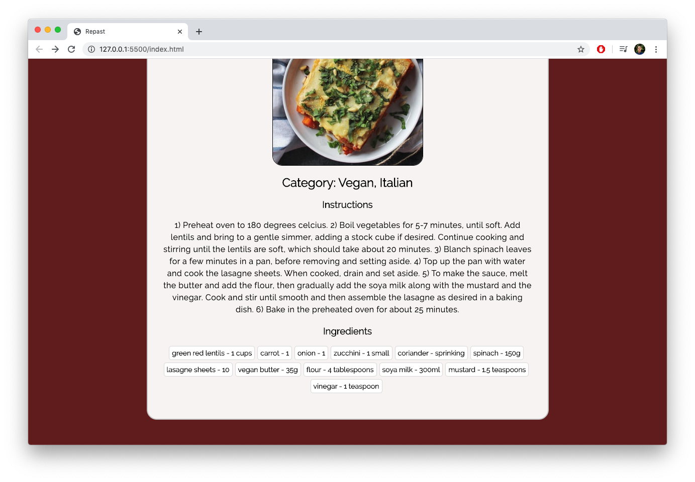

# Repast: Search for or generate a random, sumptuous meal. 
by mrivasperez - [live demo](https://mrivasperez.github.io/Repast)
## About
Repast is a responsive, single-page application to search for a sumptuous meals. It provides you with a list of meals based on search terms and when you select a meal it provides you with their ingredients and instructions to prepare. It also has the functionality to generate a random meal by clicking on the random (shuffle) button. 

I used the [themealdb.com](www.themealdb.com) API along with HTML, CSS, and Vanilla JS to built this app.

## Screenshots

> A screenshot of the Repast main screen.

> A repast search for lasagna

> The picture for this lasagna looked great, so I clicked it and now I'm on the meal page.

> Instruction and ingredients for the meal are under the picture.

## Tools used
- Google Fonts
- Font Awesome
- [themealdb.com](www.themealdb.com)